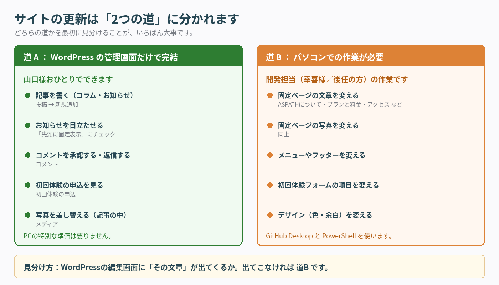
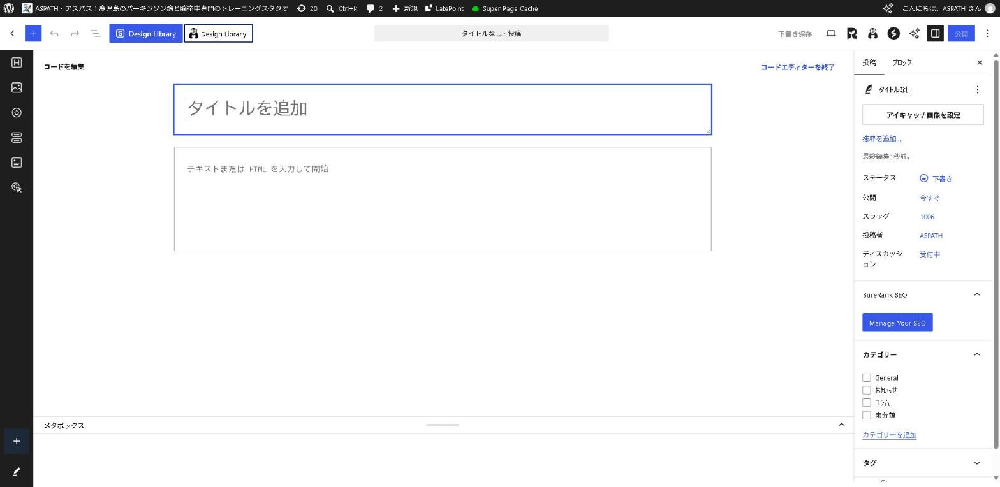
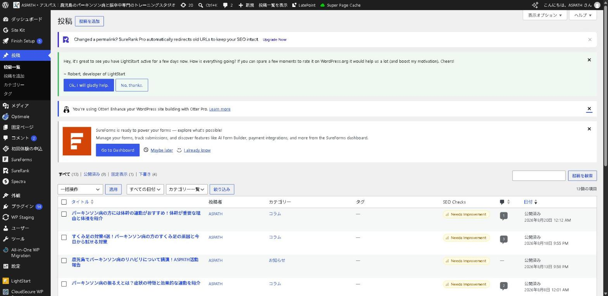
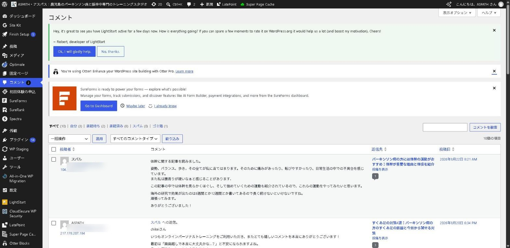
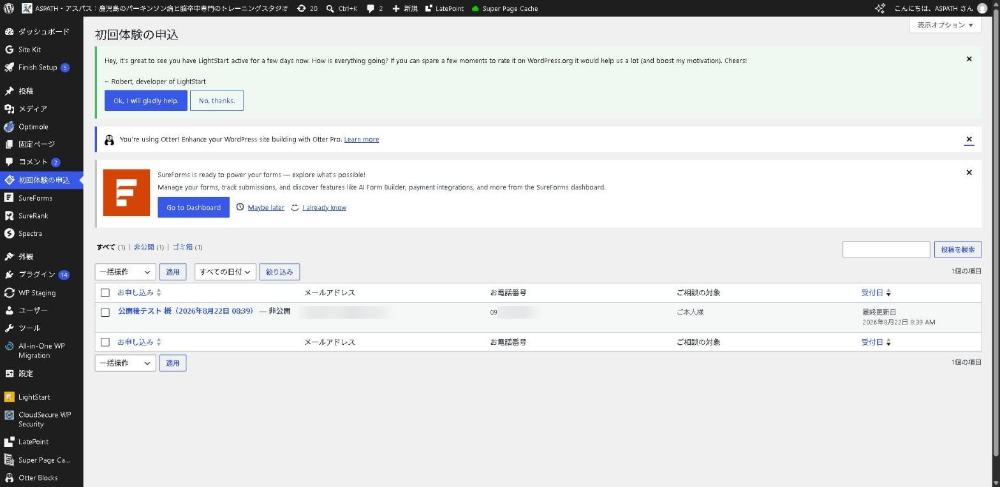
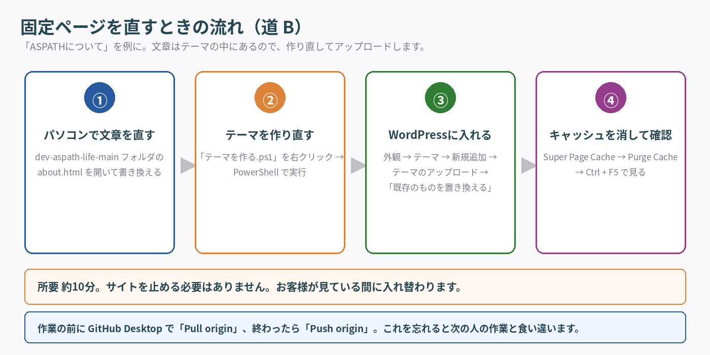
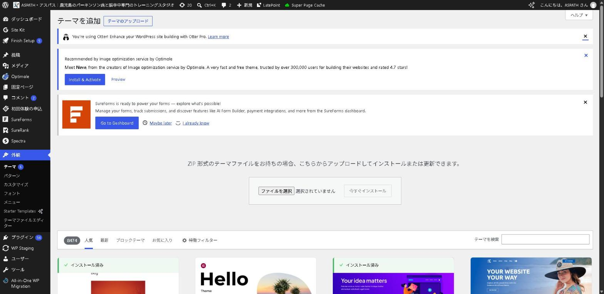
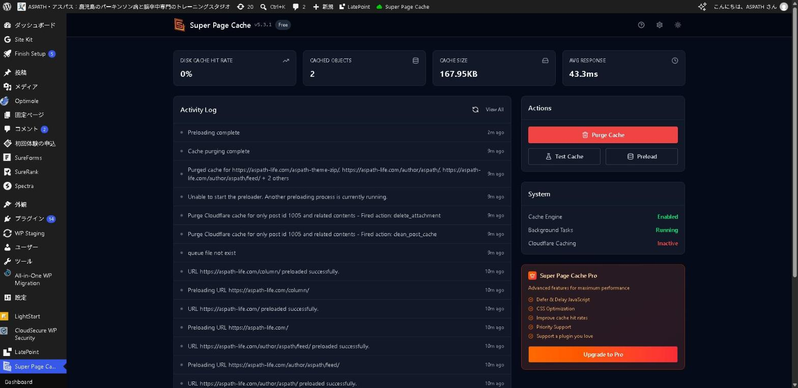

# ★ ASPATH サイト更新マニュアル（引継ぎ資料）

作成：2026年8月23日　／　**この資料は追記しながら育てていきます。**

---

## この資料の使い方

**まず「0. 2つの道」を読んでください。** そこで自分の作業がどちらかを判断し、
該当する章だけ読めば済むようにしてあります。

| 章 | 内容 | 読む人 |
|---|---|---|
| 0 | 2つの道（どちらの作業か見分ける） | **全員** |
| 1 | 記事を書く | 山口様 |
| 2 | コメントを承認する・返信する | 山口様 |
| 3 | 初回体験の申込を見る | 山口様 |
| 4 | 固定ページの文章・写真を変える | 開発担当 |
| 5 | テーマ・プラグインの入れ替え | 開発担当 |
| 6 | 困ったとき | 全員 |
| 7 | 用語のかんたん辞書 | 全員 |

---

## 0. まず知っておくこと ── 更新には「2つの道」があります



### 道A：WordPress の管理画面だけでできること（山口様の作業）

- 記事を書く（コラム・お知らせ）
- コメントの承認・返信
- 初回体験の申込を見る

### 道B：パソコンでの作業が必要なこと（開発担当の作業）

- **固定ページの文章・写真**（ASPATHについて／プランと料金／アクセス など）
- メニュー・フッター
- 初回体験フォームの項目
- デザイン（色・余白）

### なぜ分かれるのか

**固定ページの文章は、WordPressの中ではなく「テーマ」の中に書かれています。**

一般的なWordPressサイトは、管理画面で文章を打ち込みます。
このサイトは**デザインを崩さないこと**を優先したため、固定ページは
**あらかじめ形の決まったテンプレート**として作られています。

| | 一般的なサイト | このサイト |
|---|---|---|
| 文章の置き場所 | WordPressのデータベース | **テーマのファイル** |
| 直す人 | 誰でも | パソコン作業ができる人 |
| デザインの崩れ | 起きやすい | **起きない** |

> **見分け方はかんたんです。**
> WordPressの編集画面を開いて、その文章が出てくれば道A。
> 出てこなければ道Bです。

---

# 【道A】WordPressの管理画面でできること

## 1. 記事を書く（コラム・お知らせ）

### 1-1. 記事を追加する

```
https://aspath-life.com/wp-admin/post-new.php
```

または、管理画面の左メニュー **「投稿」→「投稿を追加」**



**手順**

```
1. 「タイトルを追加」に記事のタイトルを入れる
2. その下の本文エリアに文章を書く
3. 右側の「カテゴリー」で ▢コラム か ▢お知らせ にチェック  ← 必須
4. 右側の「アイキャッチ画像を設定」で一覧に出る写真を選ぶ
5. 右上の【公開】
```

> ⚠️ **カテゴリーのチェックを忘れると、一覧のどこにも出てきません。**
> 「コラム」＝読みもの、「お知らせ」＝告知、と使い分けてください。

> ⚠️ **画面の左上に「コードを編集」と出ている場合**は、
> 右上の「コードエディターを終了」を押してから書いてください。
> HTMLの生の状態になっており、そのまま書くと表示が崩れます。

### 1-2. 大事なお知らせを一番上に出す

```
投稿の編集画面 → 右側 →「投稿」タブ → ステータスと公開状態
→ 「先頭に固定表示」にチェック
```

TOPページとお知らせ一覧の**先頭に固定**され、「重要」バッジが付きます。

### 1-3. 書いた記事を見直す

```
https://aspath-life.com/wp-admin/edit.php
```



- タイトルにマウスを乗せると「編集／クイック編集／ゴミ箱へ移動／表示」が出ます
- **下書きのまま残っている記事**は「下書き」の数字から確認できます

---

## 2. コメントを承認する・返信する

```
https://aspath-life.com/wp-admin/edit-comments.php
```



**手順**

```
1. 「承認待ち」の数字をクリック
2. 内容を読む
3. 問題なければ【承認】。宣伝目的などなら【スパム】
4. 返信するときは【返信】をクリックして書く
```

**ポイント**

- **山口様の返信は承認なしですぐ公開されます。** 待つ必要はありません
- 返信はお客様のコメントの下に**字下げして**表示されます
- 一般の訪問者には「返信する」だけが見え、**「編集」は見えません**（確認済み）

> 💡 **お客様のコメントは、次の記事のネタになります。**
> いただいた質問をそのままテーマにするのが、いちばん喜ばれます。

---

## 3. 初回体験の申込を見る

```
https://aspath-life.com/wp-admin/edit.php?post_type=aspath_trial
```



**申込があると次の2つが同時に起こります。**

| | |
|---|---|
| ① | `aspathlife@gmail.com` に通知メールが届く |
| ② | この画面に記録が残る |

> **メールが届かなくても記録は残ります。** 迷惑メールに入っていた場合や
> 見落とした場合でも、ここを見れば申込は分かります。

**お客様へ返信するとき**は、通知メールにそのまま返信すれば届きます。

**入力項目（17項目）**

お名前／フリガナ／生年月日／メールアドレス／お電話番号／ご住所／
どなたについてのご相談か／医師からの診断名／診断名（その他）／
気になること・困っていること／ASPATHを知ったきっかけ／
ご希望のスタジオ・方法／現在の習いごと／趣味／普段の移動手段／
休みの日の過ごし方／メッセージ・ご質問

---

# 【道B】パソコンでの作業が必要なこと

## 4. 固定ページの文章・写真を変える

### 4-1. 全体の流れ



### 4-2. どのファイルを直すか（対応表）

**この表がいちばん大事です。** 直したいページから、開くファイルを探してください。

| サイトのページ | URL | 開くファイル |
|---|---|---|
| TOP | `/` | `index.html` |
| **ASPATHについて** | `/about/` | **`about.html`** |
| プランと料金 | `/services/` | `price.html` |
| 対面トレーニング | `/taimentraining/` | `taimentraining.html` |
| オンライン | `/onlineaspath/` | `onlineaspath.html` |
| よくある質問 | `/faq/` | `faq.html` |
| アクセス | `/access/` | `access.html` |
| お問い合わせ | `/contact/` | `contact.html` |
| サイトマップ | `/sitemap/` | `sitemap.html` |
| プライバシーポリシー | `/privacy/` | `privacy.html` |
| 特定商取引法 | `/tokushoho/` | `tokushoho.html` |
| 初回体験フォーム | `/taiken-2026as9y/` | `trial-entry.html` |
| ヘッダー・フッター | 全ページ共通 | どれか1つを直す（後述） |

ファイルの場所

```
ダウンロード
  └ ASPATH_ wordpress用_最高のLPデザイン
      └ dev-aspath-life-main
          └ dev-aspath-life-main   ← ここ
              ├ about.html
              ├ price.html
              ├ テーマを作る.ps1
              └ images/
```

### 4-3. 例：「ASPATHについて」の文章を直す

**① GitHub Desktop で Pull origin**

他の人の変更を先に取り込みます。**これを飛ばすと作業が衝突します。**

**② `about.html` をテキストエディタで開く**

メモ帳でも構いませんが、**VS Code** が扱いやすいです。

**③ 直したい文章を探す**

`Ctrl + F` で、サイトに出ている文章の**一部**を検索してください。

例：`一番初めに動かしにくさ` で検索すると、その段落が見つかります。

```html
<p class="tr-p"><span class="nw">パーキンソン病</span>において、
多くの方が一番初めに動かしにくさを感じるのが……</p>
```

**`<p ...>` と `</p>` の間の文字だけ**を書き換えます。

> ⚠️ **文章を丸ごとコピーして検索しても見つからないことがあります。**
> 上の例のように、途中に `<span class="nw">…</span>` が挟まっているためです。
> これは「パーキンソン病」のような語が変な位置で改行されないようにする印で、
> **消してはいけません。**
>
> **10〜15文字くらいの、記号を含まない部分**で検索するのがコツです。
> 上の例なら「一番初めに動かしにくさ」。

> ⚠️ **`<` や `>` の記号は消さないでください。** ここが壊れると表示が崩れます。
> 心配なときは、直す前にファイルをコピーして残しておくと安心です。

> ⚠️ **英語の切り替え表示を使っているページ**では、
> `data-en="..."` という部分に英語が入っています。
> 日本語だけ直すと英語が古いままになります。両方直すか、英語は空にしてください。

**④ 保存する**

**⑤ 「テーマを作る.ps1」を右クリック →「PowerShell で実行」**

`_wp移行素材/aspath-theme.zip` が新しくなります。

実行がブロックされる場合は、PowerShellで次を実行してください。

```powershell
powershell -ExecutionPolicy Bypass -File ".\テーマを作る.ps1"
```

**⑥ WordPressにアップロード（→ 5章へ）**

**⑦ GitHub Desktop で Commit → Push origin**

---

### 4-4. 写真を差し替える

```
1. images/ フォルダに新しい写真を同じファイル名で置く
   （名前を変える場合は、html の中の src="images/○○.webp" も直す）
2. あとは 4-3 の ⑤ 以降と同じ
```

**推奨形式：`.webp`／横1200px前後／300KB以内**

---

### 4-5. ヘッダー・フッター・メニューを変える

**全ページ共通の部分**は、`index.html` を直せば全ページに反映されます
（ビルド時に共通部分として切り出されるため）。

---

## 5. テーマ・プラグインの入れ替え

### 5-1. テーマ（サイト全体の見た目・固定ページ）

```
外観 → テーマ → 新規追加 → テーマのアップロード
→ aspath-theme.zip を選ぶ → 今すぐインストール
→ 「既存のものを置き換える」
```



> ⚠️ **「テーマを有効化」は最初の1回だけ**です。
> 2回目以降は「既存のものを置き換える」を選んでください。

> ⚠️ **`aspath-trial-form.zip` をここにアップロードしないでください。**
> 「style.css がありません」と出ます。あれはプラグインです。

### 5-2. プラグイン（初回体験フォーム）

```
プラグイン → 新規プラグインを追加 → プラグインのアップロード
→ aspath-trial-form.zip を選ぶ → 今すぐインストール
→ 「プラグインを置き換える」
```

### 5-3. どちらを入れるかの判断

| 直した内容 | テーマ | プラグイン |
|---|---|---|
| 固定ページの文章・写真 | ✅ | — |
| ヘッダー・フッター | ✅ | ✅ |
| 初回体験フォームの項目・見た目 | ✅ | **✅ 必須** |

> **迷ったら両方入れてください。** 同じ材料から作られているので、
> 両方入れて問題が起きることはありません。

### 5-4. キャッシュを消す

**入れ替えた直後は必ず実行してください。**

```
Super Page Cache → Purge Cache
そのあとブラウザで Ctrl + F5
```



---

## 6. 困ったとき

### 6-1. よくある症状と原因

| 症状 | 原因 | 対処 |
|---|---|---|
| **直したのに変わらない** | キャッシュ | Purge Cache ＋ Ctrl+F5。URL末尾に `?v=2` を付けると確実に確認できる |
| **記事が一覧に出ない** | カテゴリー未選択 | 投稿を編集し「コラム」か「お知らせ」にチェック |
| **サイトが真っ白** | テーマとプラグインの不整合 | 外観 → テーマ → 旧テーマに戻す。**見た目は即座に復帰します** |
| **「style.css がありません」** | プラグインZIPをテーマとして入れた | ファイルを確認して入れ直す |
| **管理画面が開けない** | プラグインの不具合 | ファイルマネージャで `wp-content/plugins/aspath-trial-form` のフォルダ名を変える |
| **PowerShellが実行できない** | 実行ポリシー | `powershell -ExecutionPolicy Bypass -File ".\テーマを作る.ps1"` |
| **「変更が競合しています」** | Pull を忘れた | GitHub Desktop で Pull origin してからやり直す |

### 6-2. 元に戻す方法

| 変更内容 | 戻し方 |
|---|---|
| テーマ | 外観 → テーマ → 以前のテーマに戻す |
| プラグイン | プラグイン → 停止 |
| 記事・設定 | バックアップから復元（`_wp移行素材/現行-本番サイトbak/`） |

**大きな変更の前にはバックアップを取ってください。**
All-in-One WP Migration →「エクスポート」

### 6-3. 連絡先・場所

| | |
|---|---|
| 管理画面 | `https://aspath-life.com/wp-admin/` |
| 通知先メール | `aspathlife@gmail.com` |
| ソース一式 | `Downloads/ASPATH_ wordpress用_最高のLPデザイン/dev-aspath-life-main/` |
| 詳しい経緯 | `★次にやること.md` |
| URL一覧 | `_wp移行素材/★URL一覧.md` |

---

## 7. 用語のかんたん辞書

| 言葉 | 意味 |
|---|---|
| **テーマ** | サイトの見た目と、固定ページの中身が入った「ひとかたまり」 |
| **プラグイン** | 機能を追加する部品。ここでは初回体験フォーム |
| **固定ページ** | いつも同じ内容のページ（ASPATHについて など） |
| **投稿** | 増えていくページ（コラム・お知らせ） |
| **キャッシュ** | 表示を速くするための一時保存。**更新が見えない原因の第1位** |
| **スラッグ** | URLの最後の部分。`/about/` の `about` |
| **アイキャッチ** | 一覧に出る記事の代表写真 |
| **ビルド** | HTMLからテーマZIPを作ること。`テーマを作る.ps1` の実行 |
| **Pull / Push** | 他の人の変更を取り込む／自分の変更を送る |
| **ステージング** | 練習用のサイト（`/development/`）。**今は使いません** |

---

## 8. この資料の育て方

**新しい作業を覚えたら、その日のうちにここへ足してください。**

書くときのおすすめ

```
・「どの画面を開くか」をURLで書く
・画面写真を1枚入れる（画像/ フォルダに置く）
・つまずいた点を「⚠️」で残す ← いちばん価値があります
```

**まだ書けていないこと（今後の追記予定）**

- [ ] メニュー項目の増やし方・並べ替え
- [ ] 新しい固定ページを1枚まるごと足す手順
- [ ] LINE連携まわりの設定
- [ ] Search Console・Googleビジネスプロフィールの運用
- [ ] メール（Gmail直結）の設定を変えるとき
- [ ] 年に一度のこと（ドメイン更新・サーバー更新）
