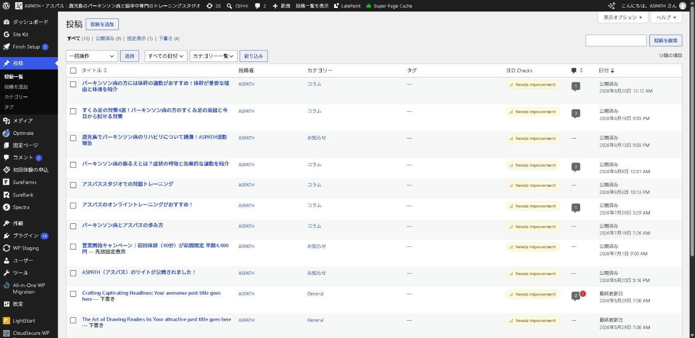
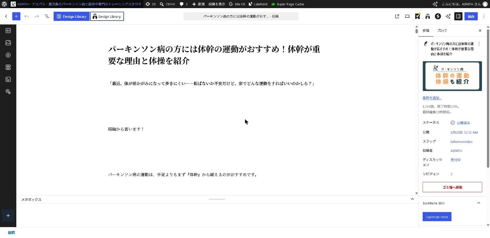
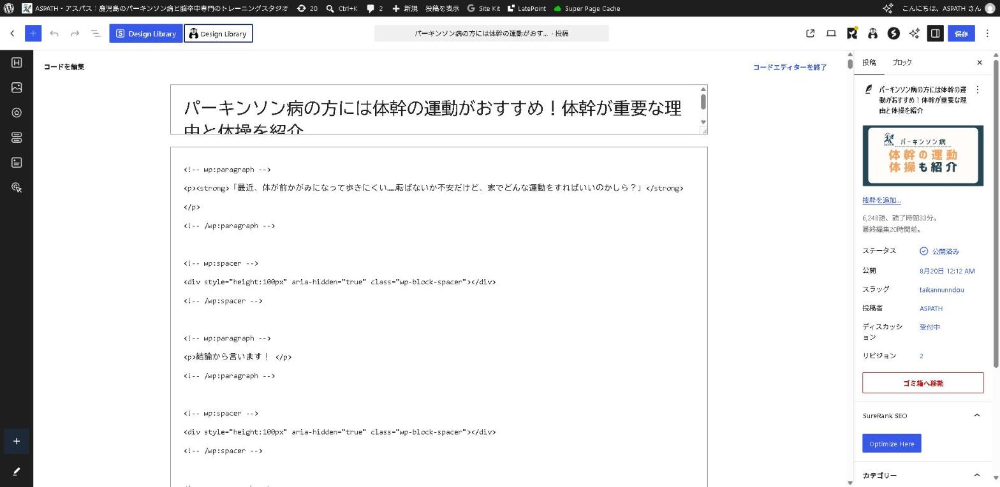
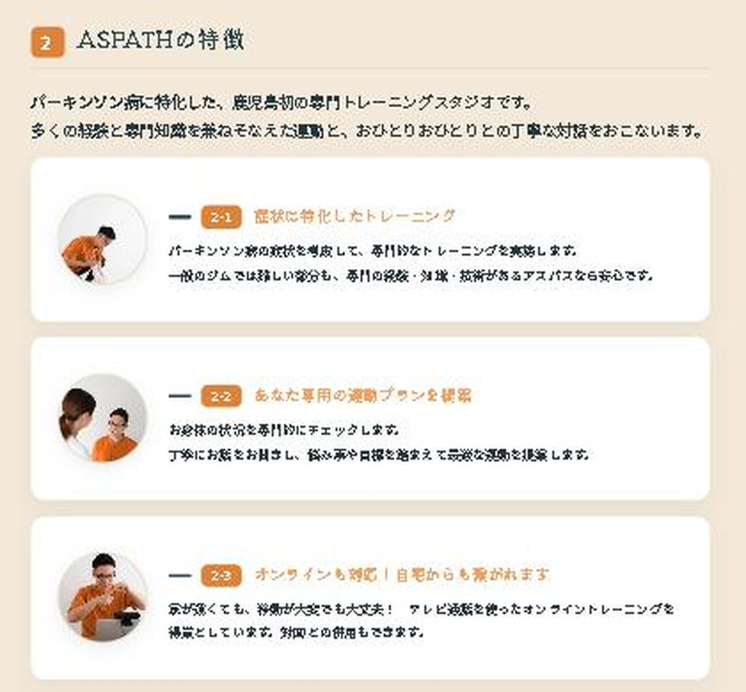

# 山口様へ ── ホームページの直し方

2026年8月23日

---

## はじめに ── 大事なことを1つだけ

ホームページには**2種類のページ**があります。

| | ページの例 | 直し方 |
|---|---|---|
| **記事** | コラム・お知らせ | **山口様ご自身で直せます** |
| **固定ページ** | ASPATHについて／プランと料金／アクセス など | **ご連絡ください。こちらで直します** |

> **「ASPATHについて」は、この資料の後半（4章）です。**
> ご自身の画面からは直せない作りになっているため、
> **「どこをどう直したいか」をお知らせいただく形**になります。
> その伝え方を、そのまま使える文例つきでご用意しました。

---

# 第1章　記事を新しく書く

## 1-1. 書きはじめる

管理画面の左メニュー **「投稿」→「投稿を追加」**


## 1-2. 書く順番

```
① 「タイトルを追加」に見出しを入れる
② その下に本文を書く
③ 右側の「カテゴリー」で
     コラム   … 読みもの
     お知らせ … 告知
   のどちらかにチェック
④ 右側の「アイキャッチ画像を設定」で、一覧に出る写真を選ぶ
⑤ 右上の【公開】
```

## 1-3. ここだけご注意ください

**カテゴリーのチェックを忘れると、記事が一覧のどこにも出てきません。**

書けているのに読んでもらえない、という状態になります。
**公開する前に、右側のチェックをもう一度ご確認ください。**

## 1-4. 大事なお知らせを一番上に出したいとき

```
右側の「投稿」タブ → ステータスと公開状態
→ 「先頭に固定表示」にチェック
```

トップページとお知らせ一覧の**一番上に固定**され、「重要」の印が付きます。

---

# 第2章　書いた記事を後から直す

**一度公開した記事も、何度でも直せます。**

## 2-1. 記事を探す

左メニュー **「投稿」→「投稿一覧」**



## 2-2. 直す

```
① 直したい記事のタイトルをクリック
② 文章を直す
③ 右上の【更新】
```

**タイトルの下にマウスを乗せる**と、次のメニューが出ます。

| 出てくる文字 | できること |
|---|---|
| **編集** | 本文をしっかり直す |
| **クイック編集** | タイトル・カテゴリー・日付だけをその場で直す |
| **表示** | 実際のページを見る |
| ゴミ箱へ移動 | 記事を消す（すぐには消えません） |

## 2-3. 編集画面はこう見えていれば正常です



**文章がそのまま読める状態**が正しい画面です。

## 2-4. もし下のような画面になっていたら



`<p>` や `<!-- wp:paragraph -->` のような記号が並んでいたら、
**右上の「コードエディターを終了」**を押してください。元の画面に戻ります。

> このまま書くと表示が崩れます。**押すだけで直りますので、ご安心ください。**

## 2-5. 写真を差し替えたいとき

```
① 記事の中の写真をクリック
② 上に出るメニューの【置換】
③ 「アップロード」か「メディアライブラリを開く」から選ぶ
④ 右上の【更新】
```

---

# 第3章　コメントに返信する


## 3-1. 手順

```
① 左メニュー「コメント」
② 「承認待ち」の数字をクリック
③ 内容を読む
④ 問題なければ【承認】／宣伝目的などは【スパム】
⑤ お返事は【返信】から
```

## 3-2. 知っておくと安心なこと

- **山口様の返信は、承認を待たずにすぐ公開されます**
- 返信はお客様のコメントの**下に少し下げて**表示されます
- 一般の方には「返信する」だけが見え、**「編集」は見えません**

> **いただいた質問は、次の記事のテーマにするのがおすすめです。**
> 同じことで困っている方が、必ずほかにもいらっしゃいます。

**※ 現在2件が承認待ちです。** お手すきのときにご確認ください。

---

# 第4章　初回体験の申込を見る


申込が入ると、**2つのことが同時に起こります。**

| | |
|---|---|
| ① | `aspathlife@gmail.com` に通知メールが届く |
| ② | 管理画面「**初回体験の申込**」に記録が残る |

> **メールを見落としても、記録は必ず残ります。**
> 迷惑メールに入っていた場合でも、この画面を見れば申込が分かります。

**お客様へのお返事**は、届いた通知メールに**そのまま返信**すれば届きます。

---

# 第5章　「ASPATHについて」など固定ページを直したいとき

## 5-1. なぜご自身で直せないのか

このホームページは、**デザインが崩れないこと**を最優先に作られています。
そのため固定ページは、文章の位置や大きさがあらかじめ決まった
**「型」**として作られています。

**文章を打ち替えるだけでレイアウトが崩れてしまう心配がない代わりに、
編集画面からは文章が見えない**、という作りです。

**直せないわけではありません。** ご連絡いただければ、こちらで直します。
**サイトは止まりませんし、10分ほどで反映されます。**

## 5-2. 伝え方 ── 番号でお知らせください

**この資料では、「ASPATHについて」の見出しに次の番号を付けています。**

> ⚠️ **この番号は、この資料の中だけの呼び名です。** 実際のページには表示されません。
> 「2-3の」とお知らせいただければ、こちらで場所が分かる、という仕組みです。

| 番号 | 見出し |
|---|---|
| **1** | ASPATHの由来 |
| **2** | ASPATHの特徴 |
| 2-1 | 症状に特化したトレーニング |
| 2-2 | あなた専用の運動プランを提案 |
| 2-3 | オンラインも対応！自宅からも繋がれます |
| 2-4 | 根本から生まれ変わるための「3つの芯」 |
| 2-5 | 運動を通じて、あなたの人生をさらに豊かに彩るために |
| 2-6 | 医療・地域と連携し、心から安心できる「第3の居場所（サードプレイス）」へ |
| 2-7 | 世界的なエビデンスの活用と、大学・有識者との共同研究による社会貢献 |

**番号と見出しの対応（説明のための図）**



**番号を覚える必要はありません。** この表を見ながら「2-3の」と書き写していただくか、
番号が分からなければ**見出しの名前をそのまま**書いていただければ大丈夫です。

## 5-3. そのまま使える連絡の文例

**LINEやメールに、下の形でお送りください。**

### 文章を直したいとき

```
ASPATHについて のページ

【場所】2-3 オンラインも対応！自宅からも繋がれます
【いまの文章】家が遠くても、移動が大変でも大丈夫！
【こう変えたい】遠方の方も、移動がご不安な方も大丈夫です。
```

### 文章を足したいとき

```
ASPATHについて のページ

【場所】2-4 根本から生まれ変わるための「3つの芯」の いちばん最後
【足したい文章】（そのまま載せる文章を書いてください）
```

### 写真を差し替えたいとき

```
ASPATHについて のページ

【場所】2-1 症状に特化したトレーニング の写真
【新しい写真】（LINEに添付してください）
```

### 見出しごと消したいとき

```
ASPATHについて のページ

【消したい場所】2-7 世界的なエビデンスの活用と…
【理由】（あれば。なくても構いません）
```

## 5-4. うまく伝えるコツ

| | |
|---|---|
| **番号を書く** | 「2-3の」と書いていただくだけで確実に伝わります |
| **いまの文章を10文字ほど写す** | 番号がなくても、これだけで場所が特定できます |
| **画面写真を撮って送る** | 直したい部分に丸を付けていただくのがいちばん確実です |
| 完璧な文章でなくてよい | 「ここをもう少し優しい言い方に」だけでも大丈夫です |

> **迷ったら、スマホでその部分の写真を撮って送ってください。** それで十分伝わります。

## 5-5. 直せる範囲

| ご希望 | |
|---|---|
| 文章を変える・足す・消す | ✅ できます |
| 写真を差し替える | ✅ できます |
| 見出しを増やす・順番を変える | ✅ できます |
| 新しいページを1枚まるごと作る | ✅ できます（少しお時間をいただきます） |
| 文字の色・大きさを変える | ✅ できます（全体の統一感を見てご相談させてください） |

---

# 第6章　困ったとき

| こんなとき | どうする |
|---|---|
| **直したのにサイトが変わらない** | しばらく待つか、`Ctrl` を押しながら `F5`。それでも変わらなければご連絡ください |
| **記事が一覧に出てこない** | カテゴリーのチェックが抜けています（1-3をご確認ください） |
| **記号だらけの画面になった** | 右上の「コードエディターを終了」（2-4） |
| **間違えて消してしまった** | ゴミ箱に残っています。「投稿一覧」→「ゴミ箱」から戻せます |
| **画面が真っ白になった** | 何も操作せず、そのままご連絡ください。すぐ元に戻せます |

> **操作を間違えても、元に戻せないことはほとんどありません。**
> 迷ったら、そのままご連絡ください。

---

## よく使う3つ（ブックマークをおすすめします）

```
記事を書く
https://aspath-life.com/wp-admin/post-new.php

コメントを見る
https://aspath-life.com/wp-admin/edit-comments.php

初回体験の申込を見る
https://aspath-life.com/wp-admin/edit.php?post_type=aspath_trial
```
